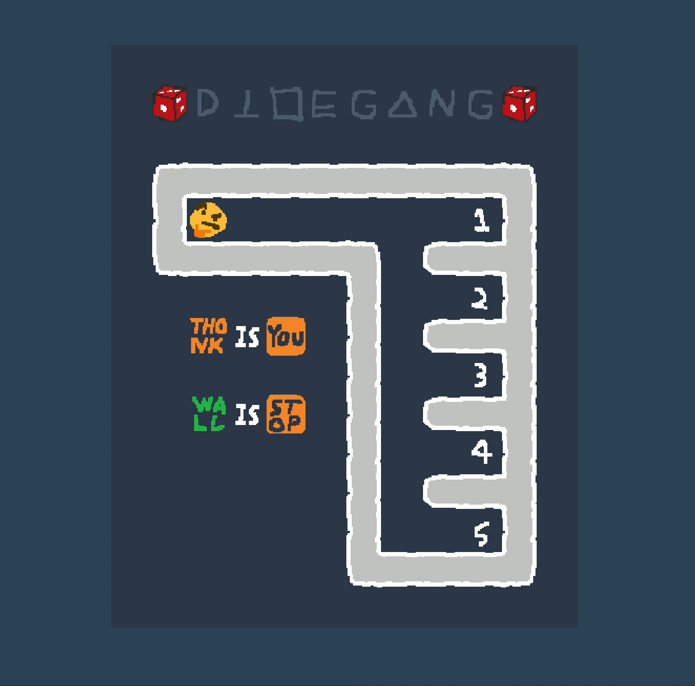

# DICE IS YOU

Try it online: [https://hgarrereyn.github.io/dice-is-you/](https://hgarrereyn.github.io/dice-is-you/)

## Overview

This repository contains source code for *Dice is you*, a challenge from DiceCTF 2021.

This challenge was inspired by [Baba is You](https://hempuli.com/baba/).

This game was built with a custom engine written in C using SDL for graphics. You need the Emscripten compiler to build the wasm target.

Build with: `./build.sh`

See [solve.py](./solve.py) for a reference z3 solution to level 5.
